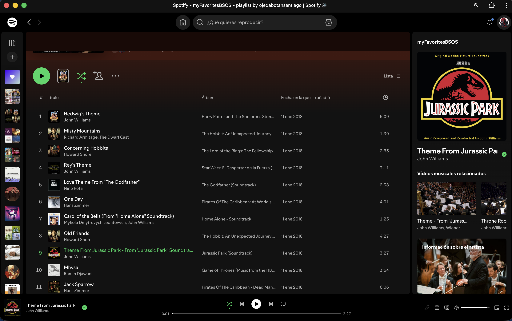

# PEC3: Manovich Reloaded — Nuevos casos de hibridación

**Autor:** Santiago Ojeda Botan  
**Asignatura:** Cultura Digital — Universitat Oberta de Catalunya (UOC)  
**Fecha:** 15 de mayo de 2026  
**Repositorio:** `PEC3_Manovich_Reloaded`  
**Licencia:** Este trabajo se publica bajo licencia [Creative Commons Atribución-NoComercial-CompartirIgual 4.0 Internacional — CC BY-NC-SA 4.0](https://creativecommons.org/licenses/by-nc-sa/4.0/deed.es).

---

## Introducción: mirar el presente con las gafas de Manovich

En *El software toma el mando*, Lev Manovich plantea que el ordenador no es solo una máquina que reproduce medios anteriores, sino un **metamedio**: un entorno capaz de simular, combinar y transformar otros medios. Esta idea permite ir más allá de la digitalización entendida como copia. Una fotografía en la pantalla no es únicamente una fotografía; puede ser imagen, base de datos, etiqueta, coordenada, recomendación, memoria personal y mercancía cultural al mismo tiempo. De la misma forma, una canción en una plataforma de *streaming* no es solo sonido: es estadística, identidad, predicción, archivo y circulación social.

Desde esta perspectiva, la hibridación no consiste simplemente en juntar medios distintos en una misma interfaz. Lo relevante es que el software permite que técnicas propias de un medio se apliquen a otro: la base de datos reorganiza la música; el calendario modifica la escritura; la interfaz social reconfigura el consumo cultural; los algoritmos de recomendación participan en la experiencia estética. Manovich denomina a este proceso **remezclabilidad profunda** (*deep remixability*): las propiedades de los medios se recombinan en el nivel de las operaciones, no solo en la superficie visual.

Este ensayo analiza dos casos contemporáneos no tratados como ejemplos centrales en el libro de Manovich: **Spotify**, entendido como una hibridación entre archivo musical, radio, red social y sistema algorítmico de recomendación; y **Notion**, entendido como una hibridación entre procesador de texto, wiki, hoja de cálculo, base de datos, gestor de proyectos y comunidad de plantillas. Ambos casos muestran cómo el software ya no se limita a ser una herramienta externa a la cultura, sino que organiza las formas de escuchar, escribir, recordar, colaborar y producir conocimiento.

La elección de estos dos ejemplos responde también al espíritu abierto de la actividad. Spotify y Notion son plataformas muy utilizadas, pero resultan interesantes porque hacen visible una tensión central de la cultura digital: el usuario gana capacidad de personalización y creación, pero esa libertad se produce dentro de infraestructuras de software diseñadas por empresas. En otras palabras, el usuario participa, remezcla y organiza, aunque siempre dentro de los marcos técnicos, económicos y algorítmicos que la plataforma hace posibles.

---

## Caso 1: Spotify y la algoritmización de la escucha musical

### Descripción del caso

Spotify nació como un servicio de música en *streaming* lanzado en 2008 y, con el tiempo, se ha convertido en una plataforma de audio que integra música, pódcast y audiolibros en determinados mercados. La propia compañía se define como un servicio orientado a conectar a creadores y audiencias, y sus páginas corporativas destacan un catálogo formado por más de 100 millones de canciones, millones de pódcast y cientos de miles de audiolibros en algunos países ([Spotify Investors, s. f.](https://investors.spotify.com/about/default.aspx)).

Sin embargo, analizar Spotify solo como una biblioteca musical sería insuficiente. Desde las gafas de Manovich, Spotify es un ejemplo claro de hibridación porque convierte el acto de escuchar en una experiencia compuesta por varias capas mediáticas. En la superficie parece una aplicación de música. En la práctica funciona como archivo, radio personalizada, red social, sistema de recomendación, base de datos cultural y panel de identidad del usuario.

La música grabada fue tradicionalmente un objeto relativamente estable: un disco, un casete, un CD o un archivo MP3. En Spotify, en cambio, la canción se integra en un flujo dinámico de datos. Cada reproducción, salto, búsqueda, lista guardada o canción marcada como favorita se transforma en información que alimenta el sistema. La escucha deja de ser un gesto privado y se convierte en una señal computable. Aquí aparece una primera hibridación: el **medio audio** se mezcla con la **lógica de la base de datos**. Una canción ya no se define solo por su título, artista o duración, sino por su posición dentro de redes de similitud, hábitos de consumo, géneros, estados de ánimo, listas colaborativas y patrones de comportamiento.

### Análisis de hibridación: Spotify con las gafas de Manovich

Manovich explica que el software no añade simplemente una capa digital a los medios existentes, sino que altera sus condiciones de producción, circulación y recepción. Spotify ejemplifica esta transformación porque combina tres tradiciones culturales: la discoteca personal, la radio programada y la recomendación social. La discoteca personal estaba basada en la propiedad: el usuario tenía una colección. La radio estaba basada en la programación: alguien decidía una secuencia de escucha. La recomendación social dependía de amigos, críticos, tiendas o comunidades musicales. Spotify remezcla estas tres lógicas en un objeto de software: el usuario conserva la ilusión de tener una colección, escucha flujos parecidos a la radio y recibe recomendaciones generadas por datos colectivos.

La hibridación se observa con claridad en listas como **Discover Weekly**, **Release Radar**, **Daily Mix** o las listas generadas con herramientas de personalización. Spotify ha explicado que funciones como Discover Weekly, Release Radar, Smart Shuffle o las sugerencias de canciones trabajan sobre la idea de una escucha personalizada y ajustable ([Spotify Newsroom, 2025](https://newsroom.spotify.com/2025-12-10/spotify-prompted-playlists-algorithm-gustav-soderstrom/)). Estas listas no son álbumes, porque no responden a una unidad autoral cerrada; tampoco son emisoras de radio tradicionales, porque no emiten lo mismo para todos; y tampoco son simples carpetas de archivos, porque cambian según los datos del usuario. Son **objetos culturales algorítmicos**.

Esta condición convierte a Spotify en un metamedio. El software simula medios anteriores —la estantería de discos, el reproductor, la radio, la lista de éxitos, la recomendación de un amigo— pero los combina en una estructura nueva. La interfaz muestra carátulas, botones de reproducción y listas, elementos heredados de tecnologías previas, pero detrás de esa familiaridad opera una arquitectura de datos. Lo que escucho hoy modifica lo que la aplicación me ofrecerá mañana. Así, la experiencia estética se vuelve recursiva: el usuario escucha al algoritmo, pero el algoritmo también escucha al usuario.

Desde la noción de **remezclabilidad profunda**, lo decisivo no es solo que Spotify mezcle canciones de distintos artistas. Lo verdaderamente híbrido es que mezcla operaciones: clasificación automática, filtrado colaborativo, curaduría editorial, interacción social, diseño de interfaz y análisis de hábitos. La lista de reproducción se convierte en una forma cultural propia del software. Puede ser privada, pública, colaborativa, editorial, generada automáticamente o sugerida por inteligencia artificial. Cada variante desplaza la autoría: a veces decide el usuario, a veces un editor humano, a veces un modelo estadístico y, con frecuencia, una combinación de todos ellos.

Spotify también puede relacionarse con la **inteligencia colectiva** de Pierre Lévy. Millones de usuarios crean listas, siguen artistas, comparten canciones e incorporan música a contextos afectivos —estudiar, correr, dormir, viajar, concentrarse—. Esa actividad colectiva produce una capa cultural que la plataforma reaprovecha. La comunidad no solo consume música; también clasifica, contextualiza y entrena el sistema. En este sentido, el *crowdsourcing* no aparece como una colaboración explícita al estilo de Wikipedia o GitHub, sino como una colaboración distribuida y parcialmente invisible: cada gesto de escucha contribuye a la organización general del catálogo.

No obstante, la mirada crítica es necesaria. La hibridación de Spotify amplía el acceso y facilita el descubrimiento, pero también desplaza poder hacia la plataforma. Si el software organiza la escucha, también puede influir en qué artistas aparecen, qué géneros se vuelven visibles y qué hábitos musicales se normalizan. La personalización promete libertad, pero puede encerrar al usuario en burbujas de gusto o convertir la exploración musical en una navegación guiada por métricas. Por ello, Spotify encaja en una hipotética segunda versión del libro de Manovich: muestra cómo el software contemporáneo no solo transforma los medios, sino que gobierna la atención cultural mediante interfaces aparentemente sencillas.

### Recursos multimedia

- 
- Enlace a la página corporativa de Spotify: <https://investors.spotify.com/about/default.aspx>
- Enlace a una entrada del Spotify Newsroom sobre personalización algorítmica: <https://newsroom.spotify.com/2025-12-10/spotify-prompted-playlists-algorithm-gustav-soderstrom/>

---

## Caso 2: Notion y la arquitectura de bloques fluidos

### Descripción del caso

Notion es una plataforma de productividad y organización que se presenta como un espacio de trabajo flexible para escribir, planificar, documentar y colaborar. Su interés como caso de hibridación no está únicamente en que reúna muchas funciones en una sola aplicación, sino en que transforma esas funciones en una gramática común: el **bloque**. Una página de Notion puede contener texto, listas, imágenes, archivos, tablas, bases de datos, calendarios, tableros Kanban, enlaces incrustados, menciones, comentarios y automatizaciones. La unidad básica ya no es la página fija del procesador de textos, sino un conjunto de objetos reordenables y convertibles.

Si Microsoft Word remediaba en gran parte la hoja de papel y la máquina de escribir, Notion se aleja de ese modelo. Su página no es una superficie cerrada pensada para imprimir, sino un espacio expandible y modular. En ella, un párrafo puede convivir con una base de datos; una tabla puede mostrarse como calendario; una lista de tareas puede transformarse en tablero; una nota puede convertirse en wiki; una página personal puede duplicarse como plantilla pública. La plataforma afirma ofrecer guías para construir sistemas de documentación, notas y bases de conocimiento para equipos ([Notion Help Center, s. f.](https://www.notion.com/help/guides/category/documentation)), y su Marketplace reúne decenas de miles de plantillas reutilizables para trabajo y vida personal ([Notion Marketplace, s. f.](https://www.notion.com/templates)).

### Análisis de hibridación: Notion con las gafas de Manovich

El caso de Notion permite observar la hibridación desde otra zona de la cultura digital: no la escucha musical, sino la escritura y la organización del conocimiento. Tradicionalmente, distintas tareas requerían distintos medios o aplicaciones: un documento para redactar, una hoja de cálculo para ordenar datos, un calendario para planificar, una wiki para documentar procesos, un gestor Kanban para coordinar proyectos y una carpeta de archivos para almacenar materiales. Notion integra esas lógicas en una misma interfaz, pero lo importante es que no las yuxtapone como herramientas separadas: las traduce a una arquitectura común de bloques y bases de datos.

Desde Manovich, esta operación es relevante porque el software separa los datos de sus representaciones. Una misma información puede mostrarse como tabla, lista, tablero, calendario, línea temporal o galería. En un medio analógico, cambiar de formato implicaba rehacer el documento. En Notion, en cambio, el contenido permanece y lo que cambia es la **vista**. Esta independencia entre estructura y visualización es una característica central de los nuevos medios: la información se vuelve modular, variable y manipulable.

El bloque funciona como un objeto de software mutante. Un fragmento de texto no queda fijado para siempre como texto: puede desplazarse, anidarse, duplicarse, comentarse, enlazarse, convertirse en tarea o integrarse en una base de datos. La página deja de ser un destino final y se convierte en una interfaz de montaje. Por eso Notion puede entenderse como un metamedio de la productividad: simula y mezcla la libreta, el archivador, el calendario, la pizarra, el gestor de proyectos, la intranet y la base de datos relacional.

La hibridación también aparece en la relación entre autoría individual y cultura compartida. El Marketplace de Notion permite publicar, vender, duplicar y adaptar plantillas. La propia plataforma destaca la existencia de más de 30.000 plantillas gratuitas y personalizables ([Notion Marketplace, s. f.](https://www.notion.com/templates)). Esto conecta con la filosofía del *crowdsourcing* y con la cultura de repositorios mencionada en el enunciado de la PEC. Igual que en GitHub un programador puede reutilizar código, en Notion un estudiante, diseñador, docente o equipo puede reutilizar una arquitectura de información ya creada por otra persona. La plantilla opera como un fragmento de “código cultural”: no contiene solo contenido, sino una forma de organizar prácticas.

Esta dimensión es especialmente interesante porque Notion convierte a usuarios no programadores en diseñadores de sistemas. Quien crea una base de datos de lecturas con etiquetas, estados, fechas y vistas no escribe código, pero sí construye una pequeña aplicación personal. Quien diseña una plantilla de seguimiento de proyectos está programando una lógica de trabajo mediante interfaz gráfica. En este punto, el software toma el mando no porque sustituya al usuario, sino porque le ofrece una gramática de acciones posibles: arrastrar, filtrar, relacionar, incrustar, duplicar, compartir.

Sin embargo, también aquí conviene introducir una lectura crítica. La flexibilidad de Notion puede producir una sensación de control total, pero esa libertad depende de una plataforma cerrada y de sus decisiones de diseño. La estética limpia, la modularidad y la posibilidad de personalización pueden ocultar que el conocimiento queda organizado según categorías predefinidas por el software. Además, la cultura de plantillas corre el riesgo de convertir la productividad en una estética: organizar la vida puede parecer equivalente a vivirla mejor. Esta tensión refuerza el interés del caso: Notion no es solo una herramienta práctica, sino un síntoma cultural de una época en la que escribir, planificar y colaborar se fusionan en una misma interfaz.

Por todo ello, Notion sería un buen ejemplo para una ampliación contemporánea de Manovich. Muestra cómo la hibridación ya no se limita a los medios audiovisuales, sino que afecta a la gestión cotidiana del conocimiento. La escritura se convierte en base de datos; la base de datos se convierte en interfaz visual; la interfaz se convierte en plantilla compartida; y la plantilla se convierte en cultura reutilizable.

### Recursos multimedia recomendados para el repositorio

- Captura de pantalla de una página de Notion con varias vistas de una misma base de datos.
- Enlace al centro de ayuda de Notion: <https://www.notion.com/help/guides/category/documentation>
- Enlace al Marketplace de plantillas: <https://www.notion.com/templates>

---

## Comparación entre los dos casos

Spotify y Notion pertenecen a ámbitos distintos, pero ambos muestran la misma transformación de fondo. En Spotify, el software reorganiza el audio; en Notion, reorganiza la escritura y la información. En el primer caso, la hibridación produce una escucha personalizada; en el segundo, una arquitectura personalizable del conocimiento. En ambos, el usuario participa en la construcción del medio, aunque lo hace dentro de una plataforma que define las reglas del juego.

La comparación permite ver tres rasgos comunes. Primero, ambos casos convierten contenidos culturales en **datos operables**: canciones, listas, páginas, tareas o notas pueden ser filtradas, recomendadas, duplicadas y reordenadas. Segundo, ambos sustituyen objetos cerrados por **procesos dinámicos**: la lista musical cambia, la base de datos se reconfigura, la plantilla se adapta. Tercero, ambos dependen de una comunidad: oyentes que entrenan recomendaciones y creadores que comparten plantillas.

La diferencia principal está en la visibilidad de la colaboración. En Spotify, la inteligencia colectiva es en gran parte opaca: el usuario alimenta el sistema con sus hábitos. En Notion, la inteligencia colectiva es más explícita: las plantillas se publican, se duplican y se modifican de forma visible. Esta diferencia permite matizar la idea de cibercultura de Lévy: no toda colaboración digital adopta la forma de una comunidad deliberada; a veces la colaboración se produce como rastro de uso capturado por la plataforma.

---

## Conclusiones

Spotify y Notion demuestran que la hibridación contemporánea no consiste únicamente en reunir texto, imagen, sonido y vídeo en una pantalla. La verdadera transformación ocurre cuando el software convierte los medios en sistemas variables, conectados y reprogramables. Spotify transforma la música en flujo algorítmico y social; Notion transforma la escritura en arquitectura modular y compartible.

Ambos casos confirman la vigencia de Manovich. El ordenador como metamedio no ha dejado de expandirse: hoy está presente en las plataformas que escuchan con nosotros, escriben con nosotros, ordenan nuestras tareas y modelan nuestra memoria cultural. Al mismo tiempo, estos ejemplos invitan a una lectura crítica: la hibridación aumenta la agencia del usuario, pero también intensifica la dependencia de infraestructuras privadas. El software permite crear nuevas formas culturales, pero también define qué formas son fáciles, visibles o recomendables.

Por eso, estudiar Spotify y Notion con las gafas de Manovich ayuda a comprender una parte fundamental de la cultura digital actual: vivimos rodeados de medios que ya no son medios aislados, sino combinaciones inestables de interfaz, base de datos, comunidad, algoritmo y economía de la atención. La hibridación no es una excepción estética; es la condición cotidiana del software contemporáneo.

---

## Bibliografía y referencias

Alberich-Pascual, J. (2018). *Elementos de la creatividad multimedia: apropiación, remediación, hibridación*. Mosaic, Universitat Oberta de Catalunya.

Creative Commons. (s. f.). *Atribución-NoComercial-CompartirIgual 4.0 Internacional — CC BY-NC-SA 4.0*. <https://creativecommons.org/licenses/by-nc-sa/4.0/deed.es>

Lévy, P. (2007). *Cibercultura: La cultura de la sociedad digital*. Anthropos Editorial.

Manovich, L. (2013). *El software toma el mando*. Editorial UOC.

Manovich, L. (s. f.). *Software Takes Command*. <https://manovich.net/index.php/projects/software-takes-command>

Notion. (s. f.). *Guides: Documentation*. <https://www.notion.com/help/guides/category/documentation>

Notion. (s. f.). *Notion Marketplace: Choose from 30,000+ Notion templates*. <https://www.notion.com/templates>

Spotify. (s. f.). *About Spotify*. <https://investors.spotify.com/about/default.aspx>

Spotify Newsroom. (2025, 10 de diciembre). *You’re in Control: Spotify Lets You Steer the Algorithm*. <https://newsroom.spotify.com/2025-12-10/spotify-prompted-playlists-algorithm-gustav-soderstrom/>

UOC eLearning Innovation Center. (s. f.). *¿Cómo citar la IA en nuestros trabajos?* <https://openaccess.uoc.edu/server/api/core/bitstreams/2ef41918-449d-4033-a6c7-1f04dad489dd/content>

---

## Declaración de uso de inteligencia artificial

Para la elaboración de esta PEC se ha utilizado inteligencia artificial generativa de forma limitada, como apoyo para la revisión sintáctica, la mejora de la estructura argumental, la comprobación de fuentes documentales y la reformulación de algunos pasajes. La selección de los casos, la interpretación final, el enfoque personal y la responsabilidad académica del contenido corresponden al autor.

Referencia orientativa siguiendo las recomendaciones de citación de IA indicadas por la UOC:

OpenAI. (2026). *ChatGPT* (GPT-5.5 Thinking) [Modelo de lenguaje de gran tamaño]. <https://chat.openai.com/>

Google. (2026). *Gemini* [Modelo de lenguaje de gran tamaño]. <https://gemini.google.com/>
